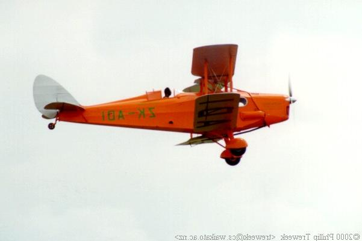
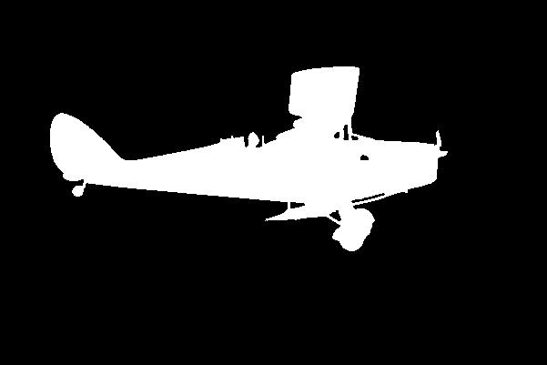
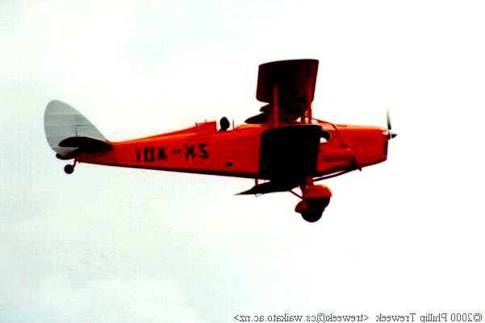
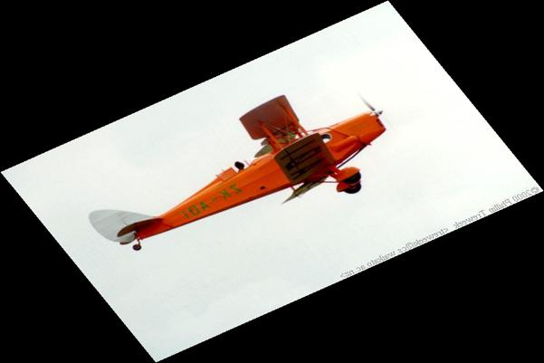
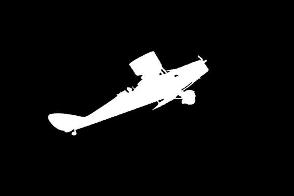
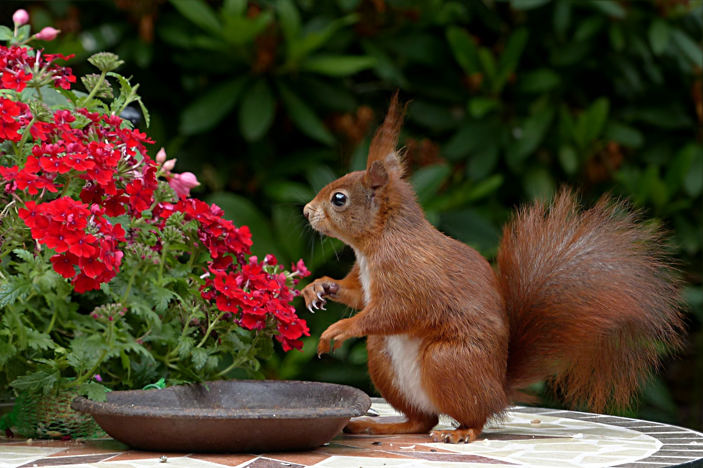
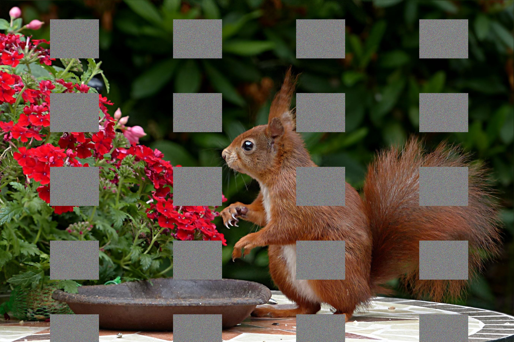
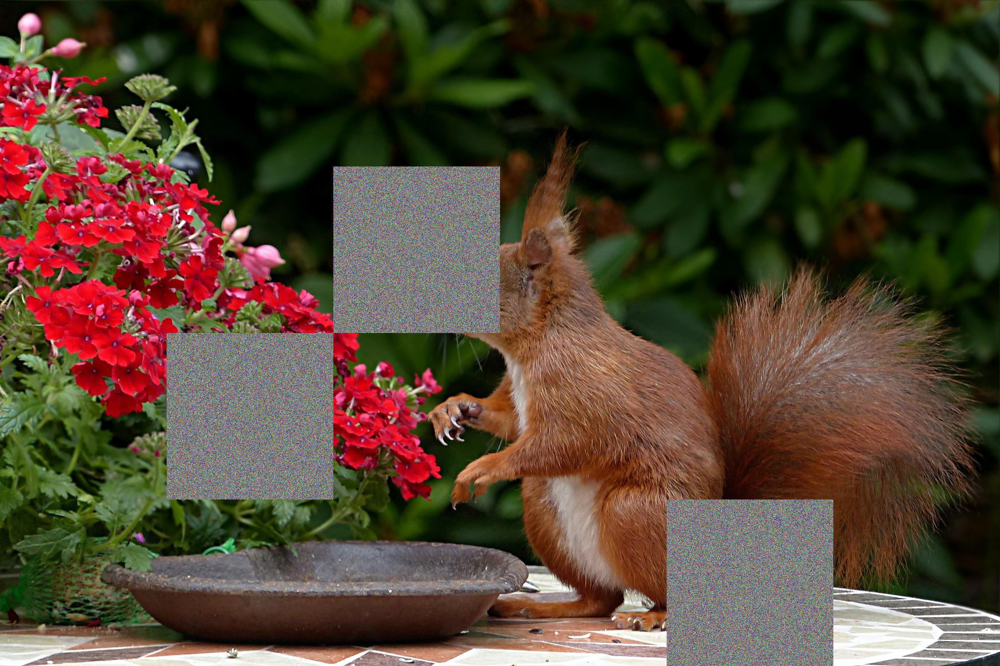

# Vyn Augment


Library to perform augmentation of images for training deep learning models. The 
transformations will be performed in the pre-processing step.

This library serves as educative library where all the transformations are methods of
the Augmentor class rather than classes themselves. This makes learning how the process
is done easier when learning or trying to modify a type of augmentation. 
Although the library performes the operations a decent speed and the 
number of transformations is large enough, other libraries like 
<a href=https://github.com/aleju/imgaug> imaug </a> or <a href=https://github.com/mdbloice/Augmentor> Augmentor </a>
are more stable and have larger number of possible transformations.

One thing that libraries like imgaug does not have is the ability of applying transformations into
a the area cover by bounding box only and to copy the bounding boxes into different backgrounds. For
the former only use `_object` after an operation as explained in [here](#selection-of-the-transformation-and-parameters)
For copying bounding boxes on different backgrounds or randomly on the same image check the transformation
`change_object`.

## Quick start guide
The purpose of this repository is to create a small library to perform image augmentation
for training deep learning networks in a flexible manner.

There are two main steps:
1. Selection of the type of augmentation and parameters.
2. Call the run function to apply to a given image/s.
 

## Selection of the transformation and parameters
Currently, all the operations require a range of values for each of the parameters.
This range is specified with the minimum value and maximum value that the user wants
to use. For instance, the rotation of an image would require 2 values: the minimum angle
and the maximum angle. Then, a uniform distribution will be used to select a value from
the range.

In addition, most of the parameters that represents the size (for instance translation of an image)
are going to be represented relative to the image size, so their value will be between 0 and 1.
Thus, parameters from operations like the crop that requires the size of the patch in the image is given by
number between 0 and 1. In the case of crop 4 values will be required representing the minimum width, maximum width
minimum height and maximum height, all of them relative to the image size.

The augmentation can be performed solely on an object by specifying the bounding box of that object
within the image. To do that the operation must contain _object. For instance, the
operation `blur` will be called `blur_object`. This requires a collection of bounding boxes. 
This variable contains a list for each image, whose values are each of the bounding boxes within the image. 
This bounding boxes are a list with 4 values [xtl, ytl, xbr, ybr], where x and y represents the x and y position,
tl means top left, and br bottom right.

A list of the current operations and parameters is:

- <b>blur</b>: (type_kernel, min_value, max_value)

The kernel type: Gaussian, median or random.
The other two parameters are the minimum and maximum of the variation for the blurriness
- Gaussian: It represents the standard deviation. The minimum value is 1e-6 and the
maximum is the size of smallest between height and width of the image size
- Median: It represents the size of the kernel. It will create a square kernel of 1's.

- <b>brightness</b>: (min_value, max_value) 
                      
The values must be between 0.05 and 10, whereas 1 means no change.
- <b>color_balance</b>: (min_value, max_value) 

The values must be between 0 and 10, whereas 1 means no change.
- <b>change_object</b>: (type, same_location, random_transformations) 

This operation copy a bounding box into a random or same location of the image or of a new image.
 1. type: String with the type of transformation ('Inter', Intra', where Inter means
		 a different image is used and intra is the same image. When `Inter` is used the background
        will be changed.
 2. same_location: Boolean indicating whether to use the same location of the boundingbox or a random location. This
    is mainly useful when using the `Inter` type, otherwise, the standard trasnformations with
    `_object` would result in the same.
 3. Dictionary with the possible transformations for the object. This is another configuration file
    like the input to `Augmentor`, however, it does not allow `_object` transformations.
```
config = {'brightness': (0.5,5.0),   # This operation uses standard extra parameters.
            'occlusion': {'values': ('cutout', 0.05, 0.1, 0.1, 0.15), 'probability':0.2},  # Using a dictionary allows passing the extra parameters.
}
```
The following config file is not allowed.
```
config = {'brightness_object': (0.5,5.0),   # This operation uses standard extra parameters.
            'occlusion': {'values': ('cutout', 0.05, 0.1, 0.1, 0.15), 'probability':0.2},  # Using a dictionary allows passing the extra parameters.
}
```
  
- <b>contrast</b>: (min_value, max_value) 

The values must be between 0 and 10, whereas 1.0 means no change.
- <b>flip</b>: (type) 

The type can be 'horizontal', 'vertical', 'both' or, 'random', representing the type of flip. 
Random will select one type of flip randomly including both, which means to flip the image horizontally and vertical
ly.- <b>greyscale</b>: No values.
- <b>grid_mask</b>: (min_x_pos, max_x_pos, min_y_pos, max_y_pos, min_width_square, max_width_square,
            min_height_square, max_heigth_square, min_x_distance_between_squares,
            max_x_distance_between_squares, min_y_distance_between_squares, max_y_distance_between_squares)
   
This transformation creates a grid of squares with noise (or a given colour) in the image.         
Values must be between 0 to 1 since they are relative to the size of the image.
Generally, the initial position should be similar to the distance between squares
This type of augmentations can be used two o three times with different parameters, since it is
good to have a lot of different grids without having too much of the image covered.
- <b>illumination</b>: (min_radius, max_radius, min_magnitude, max_magnitude)

This transformation applies bright or dark blobs in the image.
The values of radius must be between 0 and 1 representing the radius of the circle with respect 
to the size of the image. The magnitue values are between 0 and 255, representing the intensity
of the circle. Standard values are:  (0.05, 0.1, 100, 200)


- <b>noise</b>: (min_sigma, max_sigma)

The values must be between 0 and 255 and they represent the standard deviation of the gaussian 
distribution that is used to create the noise to be added to the image. The mean is 0


- <b>occlusion</b>: (type, min_height, max_height, min_width, max_width)

The are two type of occlussions:
   1. `hide_and_seek`: It creates a grid on the image and the blocks a set of patches from the grid. The number of patches
                    in the grid depends of the box size given by the other four parameters.
   2. `cutout`: Create a box in a random position on the image.
   
The other 4 parameters are betewen 0 and 1 and represents the size of the boxes.
   
   There are 2 extra parameters:
  1. `num_patches`: It can be a number or a range and by default is 1.
  2. `use_colour`: The colour of the patches, a value between 0 and 255. If negative or greater than 255
                    it will use noise. By default is noise.
- <b>posterisation</b>: (min_number_levels, max_number_levels) 

Posteristion is to crete a new image with pixel values being in a smaller range. Normally, values are between
0 and 255 with jumps of 1, if the number of levels is 32 then the values are between 0 and 255 but with jumps
of 8 (0, 7, 15, 23, ...)
Values are between 1 and 256. The idea is that each pixel can have a value between 0 and 255, so there are
256 possible values. 
- <b>rgb_swapping</b>: No values
- <b>rotation</b>: (min angle, max angle) 

Both values are in degrees. It performs a rotation of the image.
    1. `use_colour`: The colour of the patches, a value or list with 3 values between 0 and 255.
- <b>sample_pairing</b>: (min_weight, max_weight, mix_images, mix_labels). 

This transformation mixes up two different images. The mix_images and mix_labels are going to be used to be combined
with the original images linearly. The equation is weight * original_image + (1 - weight) * other_image.
For each input image a random image from mix_image and its correspondent mix_label will be 
selected for the operation.
The values for min_weight and max_weight must be between 0 and 1.
mix_images and mix_labels are a list of images and a list of one hot vectors representing the
labels of each mix_image. 
- <b>sharpness</b>: (min_value, max_value) 
                    
The values must be between -5 and 5, 1 means no changes oer the original image.
- <b>shear</b>: (type, magnitude_min, magnitude_max) 
Types are "random", 'hor', 'ver'. The magnitude are the angles to shear in degrees, so between 0 and 360
- <b>skew</b>: (type, magnitude_min, magnitude_max), 
Types are: "TILT", "TILT_LEFT_RIGHT", "TILT_TOP_BOTTOM", "CORNER", "RANDOM", "ALL".
The magnitude are values from 0 to 1.
- <b>solarise</b>: No values. It performs solarisation (max(image) - image)
- <b>translate</b>: (min_x, max_x, min_y, max_y) 

The values are relative to the size of the image. So they must be between -1 and 1. 
The operation displaces an image filling the new part with noise or a given colour. 
As extra values it can use:
   1. `use_colour`: The colour of the patches, a value between 0 and 255. If negative or greater than 255
                    it will use noise. By default is noise.  
   2. `use_replication`: When True the regions outside of the original image are padded with the image replicated 
      from the closest pixels.
- <b>zoom</b>: (min value, max value) 

The values are relative to the current size. So, 1 is the real size image (standard 0.9, 1.1)
As extra values, one can use:
   1. `use_colour`: When the zoom is smaller than 1, outside of the image will be padded with a single colour, 
      use a value outside of the range [0, 255] for noise.
   2. `use_replication`: When True the regions outside of the original image are padded with the image replicated 
      from the closest pixels.
            
            

### Extra values
In order to use the augmentation, one needs to create an object of Augmentor and populat it with a dictionary.
The minimum requirement are the values specified above, but one could add extra values. In the
previous list the extra values for a specific operations are explained. However there is one extra parameter
that can always be used.
- <b>probability</b>: This is the probability of using the operation, by default is 1, unless the operation
                        does not have any value and it will always return the same image, then the default probability
                        is 0.5. Currently, these operations are : flip, greyscale and solarise.


### Initialising augmentation
```
from Augmentation import Augmentor
config = {'brightness': (0.5,5.0),   # This operation uses standard extra parameters.
            'occlusion': {'values': ('cutout', 0.05, 0.1, 0.1, 0.15), 'probability':0.2},  # Using a dictionary allows passing the extra parameters.
}
augmentor = Augmentor(config)

```

Notice that 
```
config = {'brightness': (0.5, 5.0)}
```
is the same as
```
config = {'brightness': {'values': (0.5, 5.0)}}
```

Notice that the config's keys are the same name as the methods. Thus in case the same operation needs to be used more
than once, numbers can be used after the name. For instance,

```
config = {'brightness': {'values': (1.5, 5.0)},
           'brightness1': {'values': (0.1, 0.5)}}
```

## Applying the operations on images
Once the pipeline has been established, the image can be augmented by calling
the `run` method.
```
images_aug = augmentor.run(images, mask_positions=[], labels=[])
```

The extra parameters for the `run` method are:

- <b>mask_positions</b>: This parameter is used to specified that an image is a segmentation mask. The implication is that
                        some operations will not be performed, and some other will be perfomed differently. For instance,
                        operations that modifies the images intensities will not be applied like `contrast`, `illumination`, 
                        `solarise`, `posterise` etc... On the other hand, operations that perform a occlusion of a part of the
                        image will always use black patches regardless the user selecting noise for the patch.
- <b>labels</b>: It represents the labels of the image when using classification. This is useful for operations
                like the `sample_pairing`. Notice that one_hot vector should beb used, the reason is that `sample_pairing`
                average images and labels to create new samples and this weighted average does not make sense for one-number
                label.
- <b>bounding_boxes</b>: A list of lists of lists. This variable contains a list for each image, whose values are each of the
                    bounding boxes within the image. This bounding boxes are a list with 4 values [xtl, ytl, xbr, ybr], 
                    where x and y represents the x and y position, tl means top left and br mean bottom right.
                    When bounding boxes are passed, the run method will return a dictionary with the name
                    images for the `images` and `bounding_boxes` for the new bounding boxes after augmentation.
 
An example of image and mask augmentation for an operation that is not applied to the mask.
<table>
  <tr>
    <td> <b> Original image with mask </b> </td>
     <td><b> Augmented image with mask </b></td>
  </tr>
  <tr>
    <td><p float="left"> </p></td>
    <td><p float="left"> </p></td>
  </tr>
 </table>
 
An example of image and mask augmentation for an operation that is applied to the mask.
 <table>
  <tr>
    <td> <b> Original image with mask </b> </td>
     <td><b> Augmented image with mask </b></td>
  </tr>
  <tr>
    <td><p float="left"> </p></td>
    <td><p float="left"> </p></td>
  </tr>
 </table>
 
 ### Geometric Transformations
 
  <table>
  <tr>
    <td> <b> Original image </b> </td>
     <td><b> Augmented image skew </b></td>
     <td><b> Augmented image shear</b></td>
  </tr>
  <tr>
    <td><p float="left"> </p></td>
    <td><p float="left"></p></td>
    <td><p float="left"></p></td>
  </tr>
 </table>
 
  ### Occlussions Transformations
 
  <table>
  <tr>
    <td> <b> Original image </b> </td>
     <td><b> Augmented image with grid masks </b></td>
     <td><b> Augmented image with occlusion hide_and_seek</b></td>
  </tr>
  <tr>
    <td><p float="left"> </p></td>
    <td><p float="left"></p></td>
    <td><p float="left"></p></td>
  </tr>
 </table>

## Examples
There are two group of examples:

**Notebooks**: 
There are three notebooks following the type of augmentation that could be done for 
classification, segmentation and object detection. The notebooks are in the folder
`notebooks`

**Scripts**: 
There are also three scripts following the type of augmentation that could be done for 
classification, segmentation and object detection. The main difference with respect to
the notebooks is that the augmented images will be saved in memory (In `images/output_data/`). 
The notebooks are in the folder `bin`

As it was aforementioned the three examples follows the augmentation for three typical computer vision
applications, namely classification, segmentation and object detection. The former only needs the images to be 
augmented. The second one require images and masks whereas the third needs images and txt files with the bounding boxes.

Masks are images where the pixels of different objects have the same value, which is different for each objects. 
Bounding boxes are 4 numbers representing the x,y position in the image of the top left corner and right bottom corner 
of a box covering the object of interest in the image.
 
 ## Acknowledgements
 
 Plane images are from the dataset <a href="https://www.ime.usp.br/~eduardob/datasets/sky/"> Sky </a> under the 
 Creative commons license.
 
 Other images are from <a href="https://www.pexels.com/"> Pexels </a>, having no copyrights.
 
 The `shear`, `skewness`, `brightness`, `color_balance` and `contrast` are modifications of the same transformation from <a href="https://github.com/mdbloice/Augmentor"> Augmentor </a>"

[back](../README.md)
